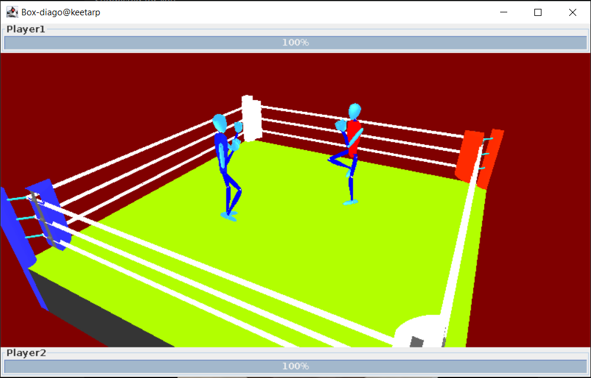

# GL2BoxingGame

GL2 Boxing Game, Use JDK-8 to run the project. 
Project is like an example, and not-at-all an example for object-oriented, hence purely functional. 
Its a 2 player game, controlled from same Keyboard, controls given below. 

### build.gradle setup
Make sure the machine achitecture is compatible with "runtime"  
My machine is Linux x64 hence I used 
###### runtime "org.jogamp.jogl:jogl-all:2.1.5:natives-linux-amd64"
###### runtime "org.jogamp.gluegen:gluegen-rt:2.1.5:natives-linux-amd64"

### Controls
#First Player | #Second Player
------------ | -------------
MOVEMENT AWSD | MOVEMENT →←↑↓
BLOCK ctrl | BLOCK NUMPAD 2
PUNCH space | PUNCH NUMPAD 1

 
 

